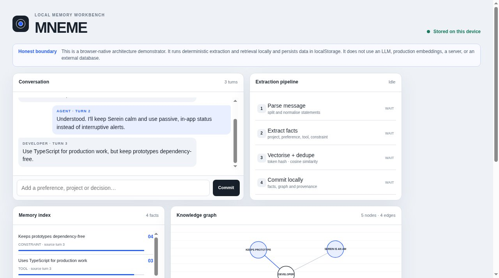

# MNEME

A local memory workbench: an interactive model of how a developer-memory system works.



**Live:** https://aeiouvcode.github.io/dev-memory/

## About

Type a message and watch it move through a memory pipeline: parsing, fact extraction (projects, preferences, tools, constraints), vectorizing with de-duplication, and commit. The workbench shows the resulting memory index, an evolving knowledge graph, top-3 cosine retrieval and session compression.

It is an honest demonstrator. Extraction and retrieval are deterministic and run locally with token hashing. There is no LLM, no production embedding model, no server and no external database. Data persists in `localStorage` and can be reset from the page.

## Run locally

```sh
git clone https://github.com/aeiouvcode/dev-memory.git
cd dev-memory
python3 -m http.server 8000
```

Then open http://localhost:8000.
